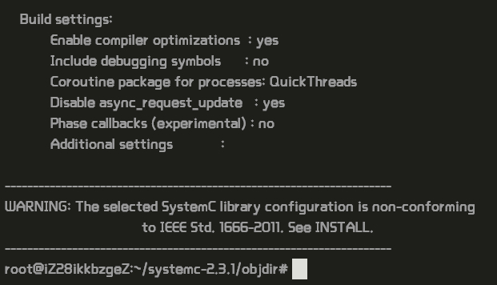
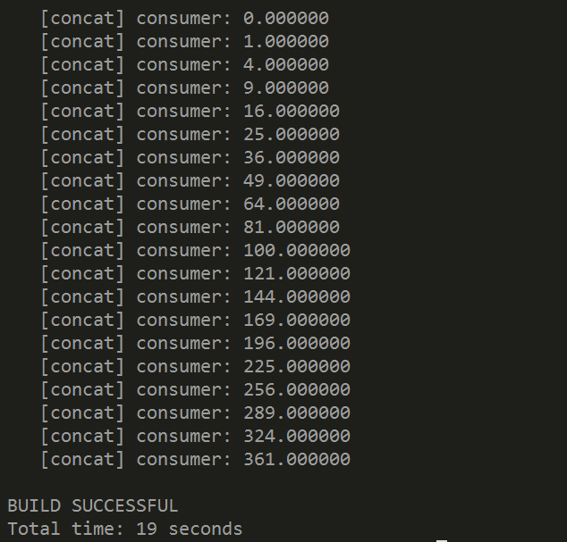

- **Description** ：DOL 框架描述(随着实验进行迭代添加、修改)；
- **How to instal** ：DOL 安装笔记；
- **Experimental experience** ：实验感想、实验心得。

-------------------

[TOC]

## Description
> 

## How to install
> 1、安装一些必要的环境(ubuntu为例)：
* `$ sudo apt-get update`
* `$ sudo apt-get install ant`
* `$ sudo apt-get install openjdk-7-jdk`
* `$ sudo apt-get install unzip`

>2、下载文件(使用Vmware虚拟机，也可以从主机拷贝到虚拟机中去http://jingyan.baidu.com/article/c33e3f48a5c153ea15cbb5b2.html)：
* `sudo wget http://www.accellera.org/images/downloads/standards/systemc/systemc-2.3.1.tgz`
* `sudo wget http://www.tik.ee.ethz.ch/~shapes/downloads/dol_ethz.zip`

>3、解压文件
* 新建dol的文件夹 
 `$ mkdir dol`
* 将dolethz.zip解压到 dol文件夹中
`$	unzip dol_ethz.zip -d dol`
* 解压systemc
`$	tar -zxvf systemc-2.3.1.tgz`

>4、编译systemc
* 解压后进入systemc-2.3.1的目录下
`$	cd systemc-2.3.1`
* 新建一个临时文件夹objdir
`$	mkdir objdir`
* 进入该文件夹objdir
`$	cd objdir`
* 运行configure(能根据系统的环境设置一下参数，用于编译)
`$	../configure CXX=g++ --disable-async-updates`
下图为运行configure之后的截图
* 编译
`$	sudo make install`
* 记录当前的工作路径(会输出当前所在路径，记下来，待会有用)
`$	pwd`

>5、编译dol
* 进入刚刚dol的文件夹
`$	cd ../dol`
* 修改build_zip.xml文件
找到下面这段话，就是说上面编译的systemc位置在哪里，
`<property name="systemc.inc" value="YYY/include"/>`
`<property name="systemc.lib" value="YYY/lib-linux/libsystemc.a"/>`
把YYY改成上页pwd的结果（注意，对于  64位 系统的机器，lib-linux要改成lib-linux64）
* 然后是编译
`$	ant -f build_zip.xml all`
若成功会显示build successful
接着可以试试运行第一个例子
* 进入build/bin/mian路径下
`$	cd build/bin/main`
* 然后运行第一个例子
`$	ant -f runexample.xml -Dnumber=1`
成功结果如图
>

## Experimental experience
* Lab1实验文档步骤清晰，按照文档配置DOL的过程中，在上面第5小步，（注意，对于  64位 系统的机器，lib-linux要改成lib-linux64），以为是对于自己电脑是64位系统的要改，一开始改了，结果后面的例子运行不成功，询问同学后改回来例子就运行成功了。
* Lab2 安装和使用Git的过程并未出现问题。
* 通过这两个实验，学习到了Git的相关知识，在此文档的编写中学习了markdown的相关语法。