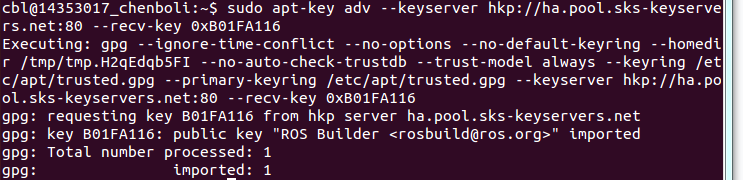
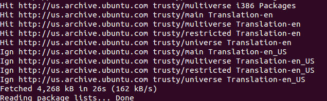
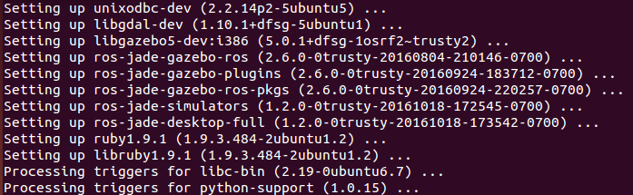
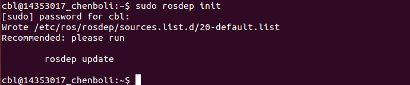
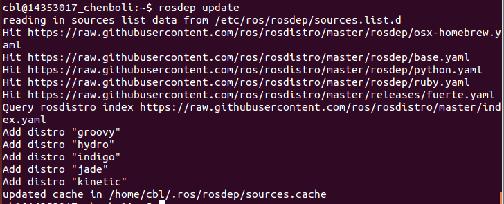
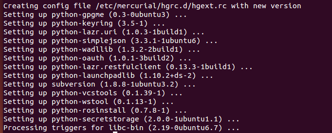

# ROS配置日志
本次实验基于**markdown**，包含以下内容：


- **Description** ：对ROS & Cartographer的描述；
- **How to install ** ：ROS 安装笔记；
- **Experimental experience ** ：实验感想、实验心得。


-----------------------------


[TOC]

## Description(ROS & Cartographer描述)

	ROS（机器人操作系统，Robot Operating System），是专为机器人软件开发所设计出来的一套电脑操作系统架构。它是一个开源的元级操作系统（后操作系统），提供类似于操作系统的服务，包括硬件抽象描述、底层驱动程序管理、共用功能的执行、程序间消息传递、程序发行包管理，它也提供一些工具和库用于获取、建立、编写和执行多机融合的程序。
	ROS的运行架构是一种使用ROS通信模块实现模块间P2P的松耦合的网络连接的处理架构，它执行若干种类型的通讯，包括基于服务的同步RPC（远程过程调用）通讯、基于Topic的异步数据流通讯，还有参数服务器上的数据存储。

```
Cartographer是谷歌公司发布的一款开源制图工具，该技术利用同步定位与制图技术(SLAM)绘制室内建筑平面图，能同时用于二维与三维空间的移动映射。同时，开源 Cartographer 还搭配有开源机器人操作系统(ROS)，使得该技术库更易于部署机器人、无人驾驶、无人机等系统。
```


## How to install(ROS & Cartographer安装笔记)

#### ROS 安装笔记

1.  配置软件库：

2.  设置软件源：sources.list：
    `sudo sh -c 'echo "deb http://packages.ros.org/ros/ubuntu $(lsb_release -sc) main" > /etc/apt/sources.list.d/ros-latest.list'`
 
3.  设置 keys：
    `sudo apt-key adv --keyserver hkp://ha.pool.sks-keyservers.net:80 --recv-key 0xB01FA116`
>

4.  安装：
* 更新软件：
  `sudo apt-get update`
>

* 完整安装桌面版ROS：
  `sudo apt-get install ros-kinetic-desktop-full`
>


5. 初始化 rosdep：
   `sudo rosdep init`
   >
   `rosdep update`
>


6. 环境配置：
   ` echo "source /opt/ros/kinetic/setup.bash" >> ~/.bashrc`
   ` source ~/.bashrc`

7. 安装 rosinstall ：
* `sudo apt-get install python-rosinstall`
>


## Experimental experience(实验心得)


* 本次实验也比较简单在ROL的过程中，按照网站给出的步骤，顺利配置。


