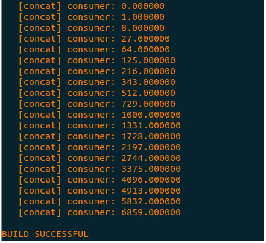
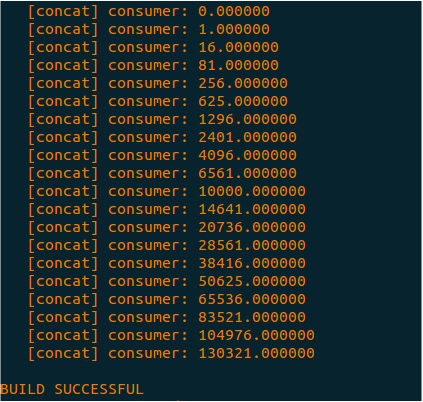

# DOL实例分析&编程

本次实验包括，包含以下内容：

- **Progress ** ：修改实例的过程；
- **Result** ：修改完实例后的结果；
- **Experimental experience ** ：实验感想。

------

[TOC]


## Progress(修改实例的过程)

### Example1: 

?	在example1中，要求修改` square.c` 中的代码，使其最终输出结果是3次方。下面是` square.c` 文件中的关键代码：

```c
int square_fire(DOLProcess *p) {
    float i;

    if (p->local->index < p->local->len) {
        DOL_read((void*)PORT_IN, &i, sizeof(float), p);
        i = i*i;
        DOL_write((void*)PORT_OUT, &i, sizeof(float), p);
        p->local->index++;
    }

    if (p->local->index >= p->local->len) {
        DOL_detach(p);
        return -1;
    }

    return 0;
}
```

其中` i = i * i` 表示当前代码最终输出的结果是2次方数。要实现输出3次方数，只需要将` i = i * i` 改成 ` i = i * i * i` 即可。修改后的代码如下：

```c
int square_fire(DOLProcess *p) {
    float i;

    if (p->local->index < p->local->len) {
        DOL_read((void*)PORT_IN, &i, sizeof(float), p);
        i = i * i * i;
        DOL_write((void*)PORT_OUT, &i, sizeof(float), p);
        p->local->index++;
    }

    if (p->local->index >= p->local->len) {
        DOL_detach(p);
        return -1;
    }

    return 0;
}
```


### Example2:

?	在example2中要求是修改` example2.xml` 中的`iterator`，使其中的square模块由`3` 个变成`2` 个，最终输出4次方数。下面是` example2.xml` 文件的关键代码：

```xml
<variable value="3" name="N"/>
```

```xml
 <!-- instantiate resources -->
  <process name="generator">
    <port type="output" name="10"/>
    <source type="c" location="generator.c"/>
  </process>

  <iterator variable="i" range="N">
    <process name="square">
      <append function="i"/>
      <port type="input" name="0"/>
      <port type="output" name="1"/>
      <source type="c" location="square.c"/>
    </process>
  </iterator>

  <process name="consumer">
    <port type="input" name="100"/>
    <source type="c" location="consumer.c"/>
  </process>

  <iterator variable="i" range="N + 1">
    <sw_channel type="fifo" size="10" name="C2">
      <append function="i"/>
      <port type="input" name="0"/>
      <port type="output" name="1"/>
    </sw_channel>
  </iterator>

```

在未修改的代码中，通过迭代定义了` 3 ` 个`  square` 模块，其中

```xml
<variable value="3" name="N"/>
```

这行代码中` value` 的值即表示迭代的次数，也表示最终生成的` square` 模块的数目，我们将这里` value` 的值设为` 2` 。修改后的代码如下：

```xml
<variable value="2" name="N"/>
```

## Result(运行结果截图)

* example1 :

* example2 : 



## Experimental experience(实验心得)

这次实验比较简单，只需要在两个文件中各自修改一行代码即可。通过本次实验对dol中各模块之间的连接方式有了一定的理解 。
